# Proyecto 2: API REST CRUD de Usuarios en Render

Este repositorio contiene la implementación de una API Backend construida con Node.js y Express, conectada a una base de datos PostgreSQL alojada en Render.

## Enlaces del Servicio
* **URL de la API:** `https://crud-usuarios-p01l.onrender.com/usuarios`

---

## Pasos de Implementación

### Paso 1: Creación de la Base de Datos PostgreSQL
Se creó una instancia de PostgreSQL en Render con plan gratuito y se obtuvo la variable de conexión `DATABASE_URL`.

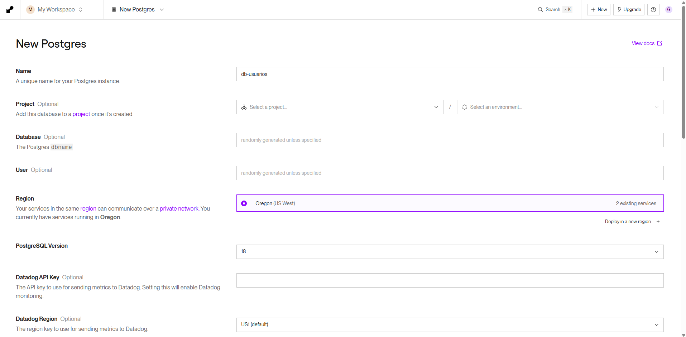

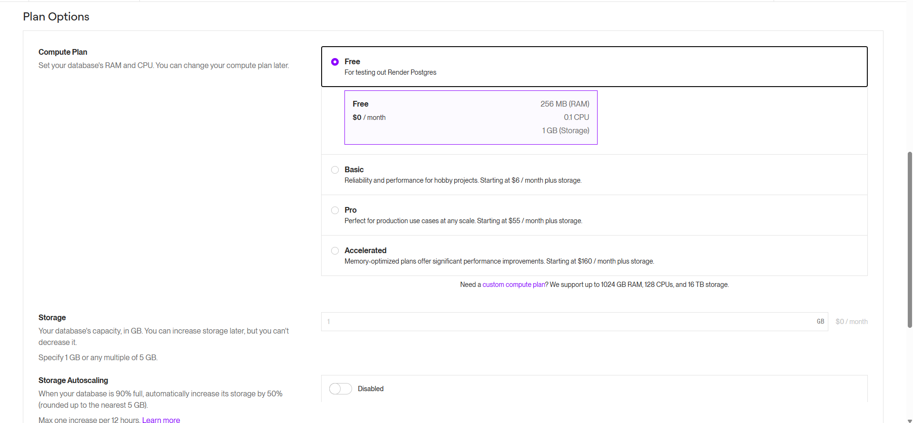

### Paso 2: Desarrollo del Servidor Backend (`server.js`)
Se programaron las operaciones CRUD completas en Node.js (GET, POST, PUT, DELETE) y la inicialización automática de la tabla `usuarios`.

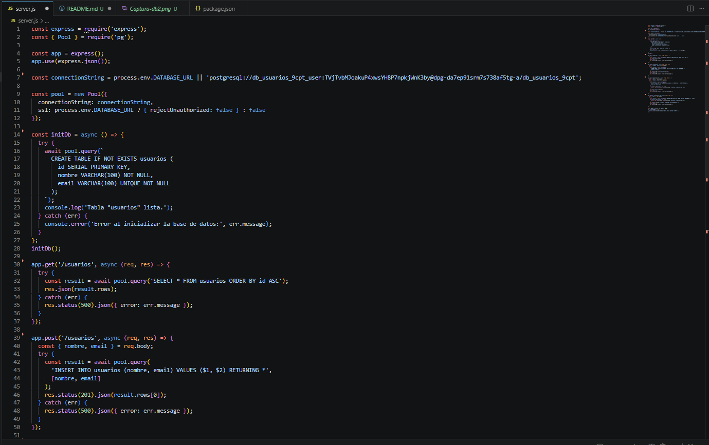

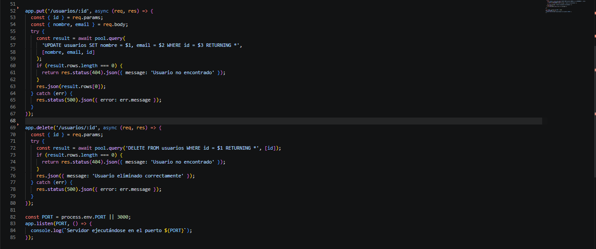

### Paso 3: Configuración del `package.json`
Se configuró el archivo `package.json` especificando las dependencias (`express`, `pg`) y el comando de arranque `"start": "node server.js"`.

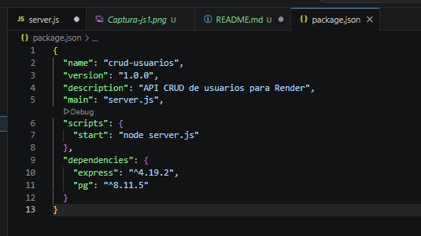

### Paso 4: Creación del repositorio
Iniciaremos el control de versiones con Git y se subieron los archivos al repositorio remoto en GitHub.

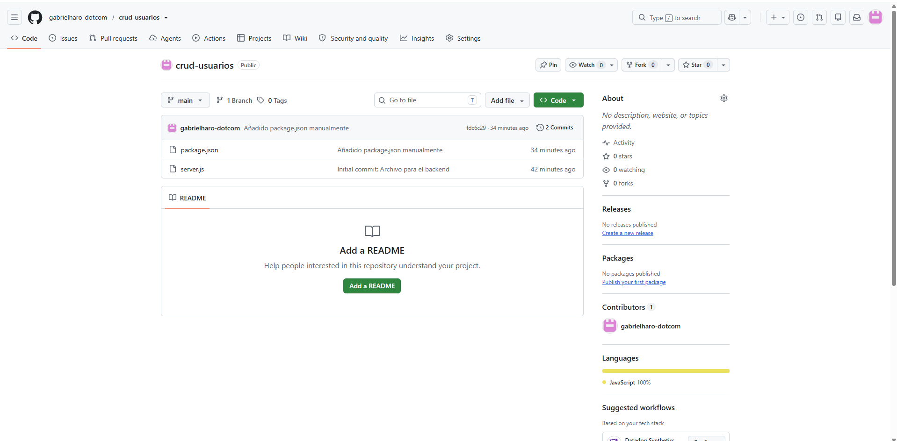

### Paso 5: Despliegue como Web Service en Render
Se creó un **Web Service** en Render conectando el repositorio, configurando el comando de inicio y enlazando la variable de entorno de PostgreSQL.

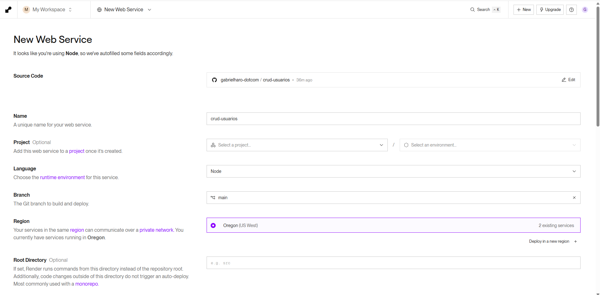

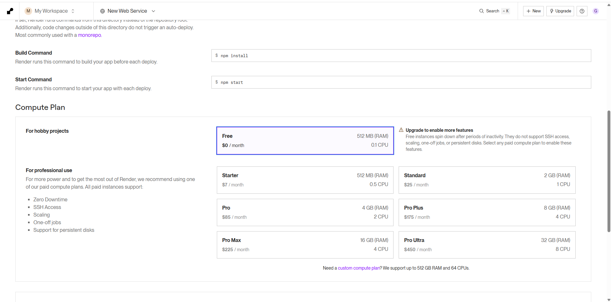

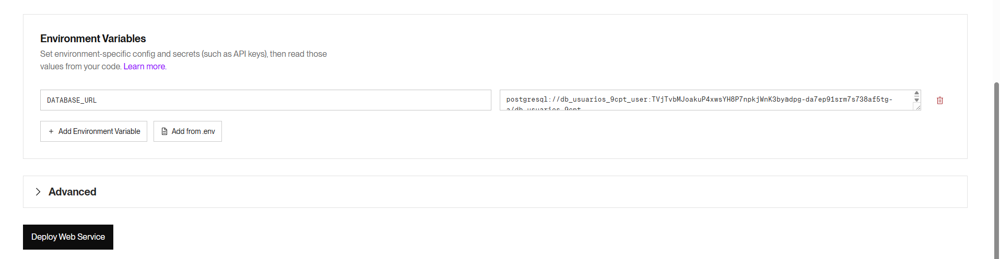

### Paso 6: Pruebas de Funcionamiento de la API
Se validó la lectura y creación de datos realizando peticiones a los endpoints del servicio. Para la validación utilizamos PostMan.

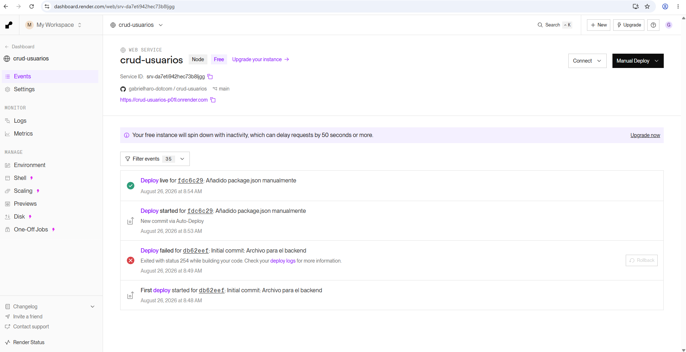

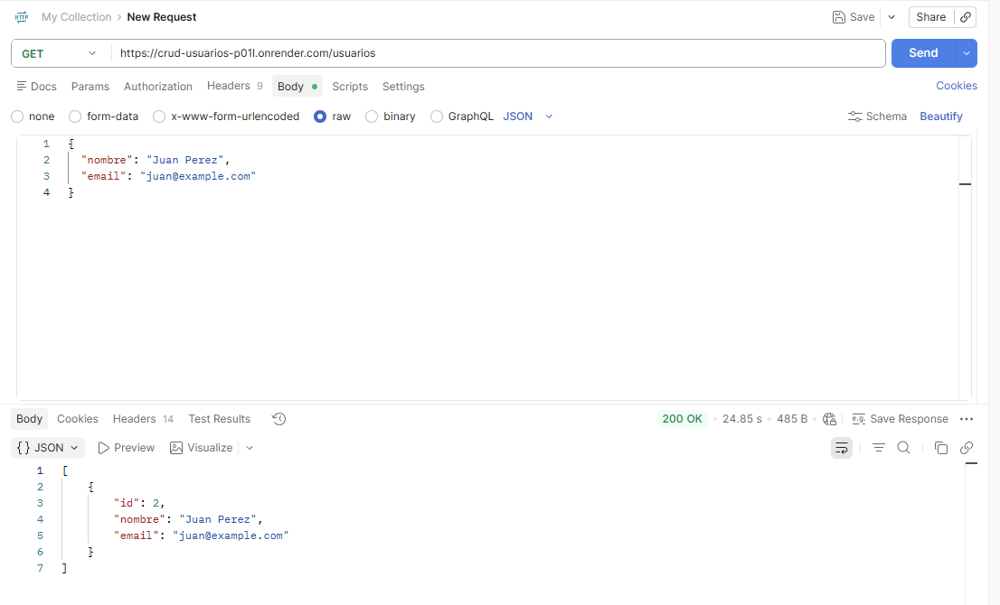

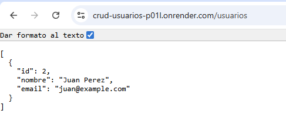